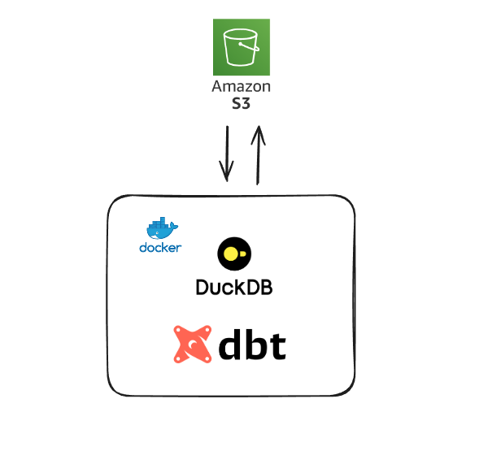
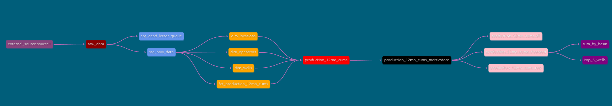

# Business Problem:
Given a sample dataset of oil & gas data, automate a process that does the following:
- Ingest csv sample data from s3 bucket
- Omits erroneus records (create a dead_letter_queue of erroneus records)
- Cleans data based on a number of hard rules and business rules
- Exports final data, along with analysis results in a different directory of the same bucket


# Tools Used
- [DuckDB](https://github.com/duckdb/duckdb)
- [dbt](https://github.com/dbt-labs/dbt-core)
- [dbt-duckdb](https://github.com/duckdb/dbt-duckdb)
- [Docker](https://www.docker.com/)

# Tools Diagram




# Architecture Diagram


Source: [Kahan Data Solutions](https://www.youtube.com/watch?v=IdCmMkQLvGA) 

# Architecture
Hybrid Model Architecture:
- Raw Layer 
    - complete record history (Auditable) (ingests the good, bad, ugly) 
- Staging layer
    - Data Vault inspired.  Apply hard rules, rename columns, dedupe records
- Star-schema at the heart of the warehouse: 
    - dimensions that conform to business concepts. This is where data integration occurs from multiple sources.
- Rules
    - Rules are built in modular components. Version controlled.
- Modeled schema =  OBT(one big table)
    - allow for metric stores based on use different use cases
- Datamarts
    - Purpose built views (with correct role access) that ingest from the metric stores. This is where analysts build.
- Reporting
    - Reports the analysts build.

# dbt Lineage


# dbt-duckdb and Sourcing Data from S3 bucket

DuckDB (and subsequently dbt) allows for the import/export of files from s3 buckets directly via the [httpfs extension](https://duckdb.org/docs/extensions/httpfs/s3api).

Pass env var AWS S3 secrets into dbt using secrets config in [profiles.yml](dbt_petroleum_analytics/profiles/profiles.yml):

```yaml
dbt_petroleum_analytics:
  outputs:
    prod:
      extensions:
      - httpfs
      - parquet
      secrets:
        - type: s3
          region: us-east-2
          key_id: "{{ env_var('ACCESS_KEY') }}"
          secret: "{{ env_var('SECRET_KEY') }}"
      type: duckdb
      path: prod.duckdb
      threads: 4
  target: prod
```

Now a source can be instantiated in the [sources.yml](dbt_petroleum_analytics/models/sources.yml)

```yaml
sources:
  - name: external_source
    meta:
      external_location: "s3://petroleum-data/input/{name}"
    tables:
      - name: source1
    config:
          external_location: "read_csv('s3://petroleum-data/input/*.csv')"
```

The source can be accessed directly in the [raw_data.sql](dbt_petroleum_analytics/models/raw/raw_data.sql)


```sql
select *
from {{ source('external_source', 'source1') }} 
```

# Staging
In the staging layer, we construct business and hash_diff keys to track entities and their record payloads.
Hard rules are applied to prepare data to be accessed.

[stg_novi_data.sql](dbt_petroleum_analytics/models/stage/stg_novi_data.sql)
```sql
with src_data as (
select api10,
       direction,
       wellname,
       welltype,
       operator,
       basin,
       subbasin,
       state,
       county,
       spuddate,
       cum12moil,
       cum12mgas,
       cum12mwater,
from {{ ref('raw_data')}} )

, hashed as (
    select
          {{ dbt_utils.generate_surrogate_key(['api10']) }} as api10_hkey
        , {{ dbt_utils.generate_surrogate_key([ 'direction', 'wellname',
                'welltype', 'operator', 'basin',
                'subbasin', 'state', 'county', 'spuddate',
                'cum12moil', 'cum12mgas', 'cum12mwater'
                ]) }} as novi_data_dhiff
        , *
        , '{{ run_started_at }}'::timestamp as load_ts_utc
    from src_data
)

select * 
from hashed
where api10 is not null 
qualify row_number() over (partition by api10_hkey order by load_ts_utc desc) = 1
```

# Star Schema
Star schema is where we take business concepts of dimensions (ex. operators) and integrate multiple data sources into the them.  The benefits of this is that the rules applied get applied to all data no matter where it comes from.
The also has the benefits of expanding analysis across other domains.
Because this example has a single source, it's a bit boring for now.
Furthermore we apply transformations at this layer, making sure we clean the dimension for all downstream use cases.

[dim_operators.sql](dbt_petroleum_analytics/models/star/dim_operators.sql)
```sql 
select {{ dbt_utils.generate_surrogate_key(['operator']) }} as operator_keyhash
     , operator as operator_name
     , 'novi_raw_data' as record_source
     , load_ts_utc
from {{ ref('stg_novi_data') }}
qualify row_number() over (partition by operator_keyhash order by load_ts_utc) = 1
```

# Hard Rules vs Business Rules

Rules seperated into two segments:
- Hard Rules (Pre Processing Rules)
    - Activate the data (by fixing data type issues)
- Soft Rules/Business Rules (Post Processing Rules)
    - Transform the data based on downstream use cases

Rules need to be modular and version controlled!  Customers will likely question methods.

# Modeled Schema
This is the OBT(One Big Table).  The grain must be consistent and all associated data is built in.
This acts as a metric store, where analysts can pick and choose what columns are needed for their reports.


# bash commands:

`cd dbt_petroleum_analytics`

`docker build -t novi .`

`docker run --env-file .env novi  dbt run --profiles-dir /usr/app/profiles`


# Data outputs

[metric_store.csv](resources/output_files/metric_store.csv)

[novi_dead_letter_queue.csv](resources/output_files/novi_dead_letter_queue.csv)

[sum_by_basin.csv](resources/output_files/sum_by_basin.csv)

[top_5_wells.csv](resources/output_files/top_5_wells.csv)


# Resources used:
[Data Engineering with dbt: Roberto Zagni](https://a.co/d/0gcuX40)

[Containerizing dbt code with Docker for Streamlined Data Transformation: Aparna S](https://medium.com/@aparna_satheesh/containerizing-dbt-code-with-docker-for-streamlined-data-transformation-ce98b7880a10)

