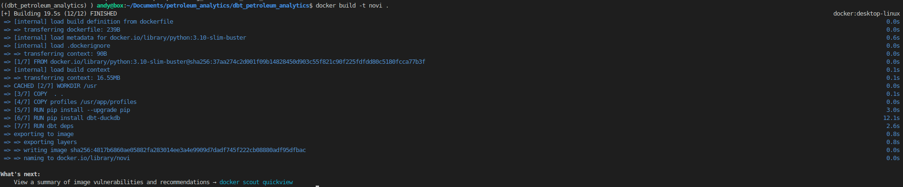
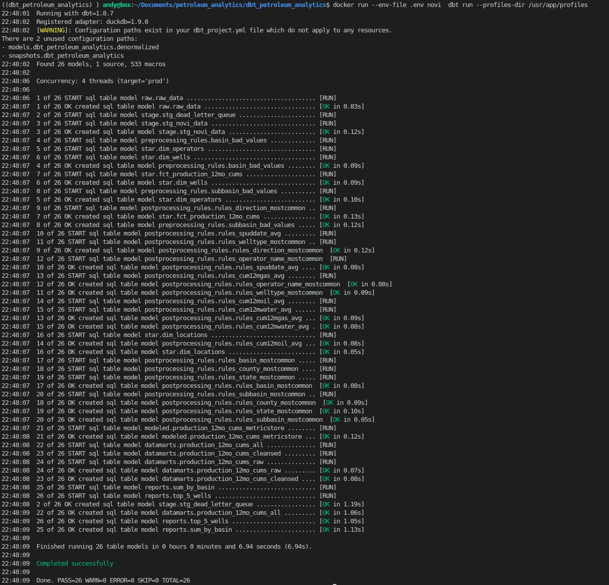
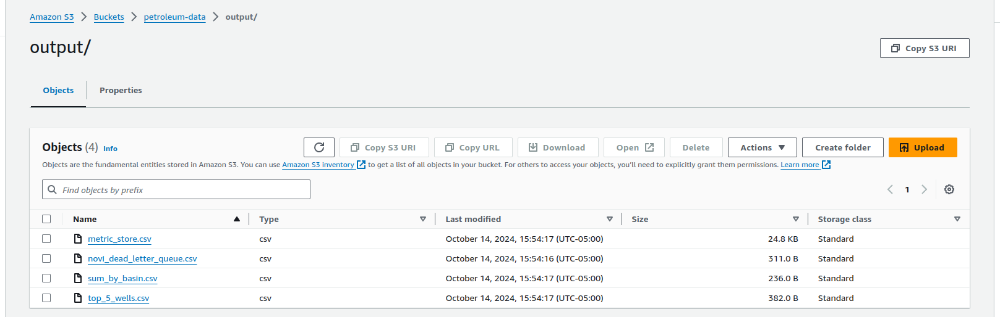

# Business Problem:
Given a sample dataset of oil & gas data, automate a process that does the following:
- Ingest csv sample data from s3 bucket
- Omits erroneous records (create a dead_letter_queue of erroneous records)
- Cleans data based on a number of hard rules and business rules
- Exports final data, along with analysis results in a different directory of the same bucket


# Tools Used
- [DuckDB](https://github.com/duckdb/duckdb)
- [dbt](https://github.com/dbt-labs/dbt-core)
- [dbt-duckdb](https://github.com/duckdb/dbt-duckdb)
- [Docker](https://www.docker.com/)

# Tools Diagram


# Architecture Diagram


Source: [Kahan Data Solutions](https://youtu.be/IdCmMkQLvGA?t=500) 

# Architecture
Hybrid Model Architecture:
- Raw Layer 
    - complete record history (Auditable) (ingests the good, bad, ugly) 
- Staging layer
    - Data Vault inspired.  Apply hard rules, rename columns, dedupe records
- Star-schema at the heart of the warehouse: 
    - dimensions that conform to business concepts. This is where data integration occurs from multiple sources.
- Rules
    - Rules are built in modular components. Version controlled.
- Modeled schema =  OBT(one big table)
    - allow for metric stores based on use different use cases
- Datamarts
    - Purpose built views (with correct role access) that ingest from the metric stores. This is where analysts build.
- Reporting
    - Reports the analysts build.

# dbt Lineage


# dbt-duckdb and Sourcing Data from S3 bucket

DuckDB (and subsequently dbt) allows for the import/export of files from s3 buckets directly via the [httpfs extension](https://duckdb.org/docs/extensions/httpfs/s3api).

Pass env var AWS S3 secrets into dbt using secrets config in [profiles.yml](dbt_petroleum_analytics/profiles/profiles.yml):

```yaml
dbt_petroleum_analytics:
  outputs:
    prod:
      extensions:
      - httpfs
      - parquet
      secrets:
        - type: s3
          region: us-east-2
          key_id: "{{ env_var('ACCESS_KEY') }}"
          secret: "{{ env_var('SECRET_KEY') }}"
      type: duckdb
      path: prod.duckdb
      threads: 4
  target: prod
```

Now a source can be referenced in the [sources.yml](dbt_petroleum_analytics/models/sources.yml)

```yaml
sources:
  - name: external_source
    meta:
      external_location: "s3://petroleum-data/input/{name}"
    tables:
      - name: source1
    config:
          external_location: "read_csv('s3://petroleum-data/input/*.csv')"
```

The source can be accessed directly in the [raw_data.sql](dbt_petroleum_analytics/models/raw/raw_data.sql)


```sql
select *
from {{ source('external_source', 'source1') }} 
```

# Staging
In the staging layer, we construct business and hash_diff keys to track entities and their record payloads.
Hard rules are applied to prepare data to be accessed.

[stg_novi_data.sql](dbt_petroleum_analytics/models/stage/stg_novi_data.sql)
```sql
with src_data as (
select api10,
       direction,
       wellname,
       welltype,
       operator,
       basin,
       subbasin,
       state,
       county,
       spuddate,
       cum12moil,
       cum12mgas,
       cum12mwater,
from {{ ref('raw_data')}} )

, hashed as (
    select
          {{ dbt_utils.generate_surrogate_key(['api10']) }} as api10_hkey
        , {{ dbt_utils.generate_surrogate_key([ 'direction', 'wellname',
                'welltype', 'operator', 'basin',
                'subbasin', 'state', 'county', 'spuddate',
                'cum12moil', 'cum12mgas', 'cum12mwater'
                ]) }} as novi_data_dhiff
        , *
        , '{{ run_started_at }}'::timestamp as load_ts_utc
    from src_data
)

select * 
from hashed
where api10 is not null 
qualify row_number() over (partition by api10_hkey order by load_ts_utc desc) = 1
```

# Star Schema
Star schema is where we take business concepts of dimensions (ex. operators) and integrate multiple data sources into the them.  The benefits of this is that the rules get applied to all data no matter where it comes from.
The also has the benefits of expanding analysis across other domains.
Because this example has a single source, it's a bit simple at present.
Furthermore we apply transformations at this layer, making sure we clean the dimension for all downstream use cases.

[dim_operators.sql](dbt_petroleum_analytics/models/star/dim_operators.sql)
```sql 
select {{ dbt_utils.generate_surrogate_key(['operator']) }} as operator_keyhash
     , operator as operator_name
     , 'novi_raw_data' as record_source
     , load_ts_utc
from {{ ref('stg_novi_data') }}
qualify row_number() over (partition by operator_keyhash order by load_ts_utc) = 1
```

# Hard Rules vs Business Rules

Rules separated into two segments:
- Hard Rules (Pre Processing Rules)
    - Activate the data (by fixing data type issues)
- Business Rules (Post Processing Rules)
    - Transform the data based on downstream use cases

Rules need to be modular and version controlled!  Customers/analysts will likely question methods.

# Preprocessing Rules

Example of preprocessing rule, catching bad data that can be used to create filters or highlight erroneous data.

```sql
select basin as basin_bad_values
from {{ ref('stg_novi_data') }}
where regexp_matches(basin, '[0-9]')
```

# Post Processing Rules
For rules like "most common basin", we don't want to use the file as context(it could just be a few records).

It's better to use a larger context dataset to compute these metrics. 

[rules_basin_mostcommon.sql](dbt_petroleum_analytics/models/postprocessing_rules/rules_locations/rules_basin_mostcommon.sql)
```sql 
select basin as basin_mostcommon
from {{ ref('dim_locations') }}
group by all
order by count(*) desc
limit 1
```

# Modeled Schema
This is the OBT(One Big Table).  The grain must be consistent and all associated data is built in.
This acts as a metric store, where analysts can pick and choose what columns are needed for their reports.

```sql 
--BRING IN DIMS AND FACTS
with dim_locations as (
    select * from {{ ref('dim_locations') }}
)

, dim_operators as (
    select * from {{ ref('dim_operators') }}
)

, dim_wells as (
    select * from {{ ref('dim_wells') }}
)

, fct_production_12mo_cums as (
    select * from {{ ref('fct_production_12mo_cums') }}
)


--BRING IN RULES

, rules_direction_mostcommon as (
    select * from {{ ref('rules_direction_mostcommon')}}
)

, rules_basin_mostcommon as (
    select * from {{ ref('rules_basin_mostcommon')}}
)

, rules_subbasin_mostcommon as (
    select * from {{ ref('rules_subbasin_mostcommon')}}
)

, rules_welltype_mostcommon as (
    select * from {{ ref('rules_welltype_mostcommon')}}
)

, rules_state_mostcommon as (
    select * from {{ ref('rules_state_mostcommon')}}
)

, rules_county_mostcommon as (
    select * from {{ ref('rules_county_mostcommon')}}
)

, rules_operator_name_mostcommon as (
    select * from {{ ref('rules_operator_name_mostcommon')}}
)

, rules_cum12mgas_avg as (
    select * from {{ ref('rules_cum12mgas_avg')}}
)

, rules_cum12moil_avg as (
    select * from {{ ref('rules_cum12moil_avg')}}
)

, rules_cum12mwater_avg as (
    select * from {{ ref('rules_cum12mwater_avg')}}
)

, rules_spuddate_avg as (
    select * from {{ ref('rules_spuddate_avg')}}
)

--join dims to facts

, base_data as (
    select w.api10
     , w.direction
     , w.wellname
     , w.welltype
     , w.spuddate
     , o.operator_name
     , l.basin
     , l.subbasin
     , l.state
     , l.county
     , p.cum12moil
     , p.cum12mgas
     , p.cum12mwater
     , p.load_ts_utc as production_load_ts
from fct_production_12mo_cums p 
left join dim_wells w
  on p.well_keyhash = w.well_keyhash
left join dim_operators o 
  on p.operator_keyhash = o.operator_keyhash
left join dim_locations l 
  on p.location_keyhash = l.location_keyhash
)

--join denormalized data with rules to show before vs after columns

select api10
     , direction
     , coalesce(direction, (select * from rules_direction_mostcommon)) as direction_cleansed
     , wellname
     , welltype
     , coalesce(welltype, (select * from rules_welltype_mostcommon)) as welltype_cleansed
     , spuddate
     , coalesce(spuddate, (select * from rules_spuddate_avg)) as spuddate_cleansed
     , operator_name
     , coalesce(operator_name, (select * from rules_operator_name_mostcommon)) as operator_name_cleansed
     , basin
     , coalesce(basin, (select * from rules_basin_mostcommon)) as basin_cleansed
     , subbasin
     , coalesce(subbasin, (select * from rules_subbasin_mostcommon)) as subbasin_cleansed
     , state
     , coalesce(state, (select * from rules_state_mostcommon)) as state_cleansed
     , county
     , coalesce(county, (select * from rules_county_mostcommon)) as county_cleansed
     , cum12moil
     , coalesce(cum12moil, (select * from rules_cum12moil_avg)) as cum12moil_cleansed
     , cum12mgas
     , coalesce(cum12mgas, (select * from rules_cum12mgas_avg)) as cum12mgas_cleansed
     , cum12mwater
     , coalesce(cum12mwater, (select * from rules_cum12mwater_avg)) as cum12mwater_cleansed
     , production_load_ts
from base_data
order by api10
```

# Reports
This is the final reporting layer that serves the final 2 reports.

A post hook is called to send the result set to the s3 bucket.

```sql
{{ config(
  post_hook = "copy {{this}} to 's3://petroleum-data/output/sum_by_basin.csv'"
) }}

--The sum of each of cum12moil, cum12mgas and cum12mwater, by basin

select basin_cleansed as basin
     , sum(cum12moil_cleansed)   as sum_cum12moil
     , sum(cum12mgas_cleansed)   as sum_cum12mgas
     , sum(cum12mwater_cleansed) as sum_cum12mwater
from {{ ref('production_12mo_cums_cleansed') }}
group by basin_cleansed
order by 2 desc, 3 desc, 4 desc
```

```sql
{{ config(
  post_hook = "copy {{this}} to 's3://petroleum-data/output/top_5_wells.csv'"
) }}

--The top 5 oil wells by cum12moil, sorted in descending order

select api10
     , operator_name_cleansed as operator_name
     , wellname
     , state_cleansed as state
     , county_cleansed as county
     , cum12moil_cleansed
from {{ ref('production_12mo_cums_cleansed')}}
order by cum12moil_cleansed desc
limit 5
```

# Docker
The application was dockerized. The image was built and ran localy.

```docker
FROM python:3.10-slim-buster

ENV DBT_PROFILES_DIR=/usr/app/profiles

WORKDIR /usr

COPY  . .

COPY profiles /usr/app/profiles

RUN pip install --upgrade pip 
RUN pip install dbt-duckdb 
RUN dbt deps 
```
Docker commands:

`cd dbt_petroleum_analytics`

`docker build -t novi .`



`docker run --env-file .env novi  dbt run --profiles-dir /usr/app/profiles`



# Data outputs




[metric_store.csv](resources/output_files/metric_store.csv)

[novi_dead_letter_queue.csv](resources/output_files/novi_dead_letter_queue.csv)

[sum_by_basin.csv](resources/output_files/sum_by_basin.csv)

[top_5_wells.csv](resources/output_files/top_5_wells.csv)

In the metric store a decision was made to 

# Future Work

- Add documentation
- Add testing
- Integrate additional data
- Incorporate into Airflow DAG
- Build and execute Terraform script


# Resources used:
[Data Engineering with dbt: Roberto Zagni](https://a.co/d/0gcuX40)

[Containerizing dbt code with Docker for Streamlined Data Transformation: Aparna S](https://medium.com/@aparna_satheesh/containerizing-dbt-code-with-docker-for-streamlined-data-transformation-ce98b7880a10)

[dbt-duckdb Docs](https://github.com/duckdb/dbt-duckdb)


# other links

Checkout my Data Engineer Capstone Project [here](https://github.com/ANelson82/de_zoomcamp_2022_earthquake_capstone)

My [LinkedIN](https://www.linkedin.com/in/andynelson1982/)