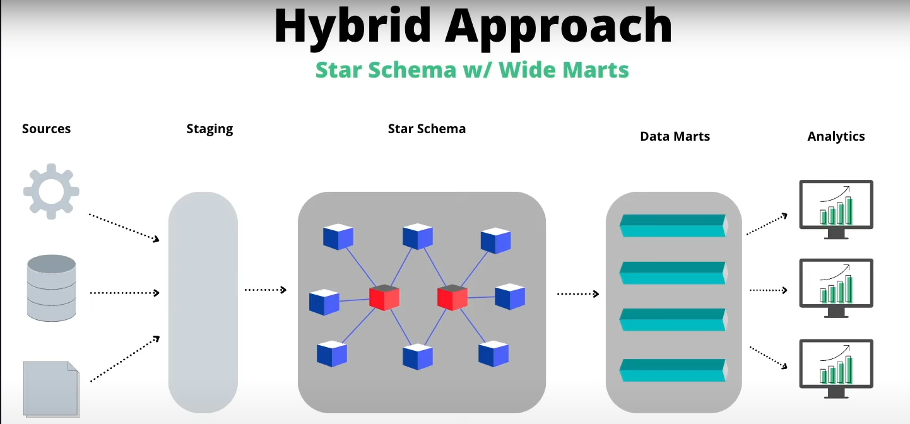

# petroleum_analytics

# Installing dbt and duckdb

bash
`pipenv install Pipfile`

# Data Warehouse Philosophy
From Bill Inmon:

A data warehouse should be:
- Subject Oriented
    - Built around business concepts (top down)
- Integrated
    - Ingest data from multiple sources/systems (bottoms up)
- Nonvolatile
    - A datawarehouse should should be a written (unchanging) record of all incoming data (pen > pencil)
- Time Variant
    - Capturing data across time is essential to analytics

# Architecture
I like to follow a hybrid model:
- star-schema at the heart of the warehouse: 
    - dimensions that conform to business concepts 
- serving layer or data marts being OBT(one big table)
    - allow for metric stores based on use different use cases

Source: [Kahan Data Solutions](https://www.youtube.com/watch?v=IdCmMkQLvGA)